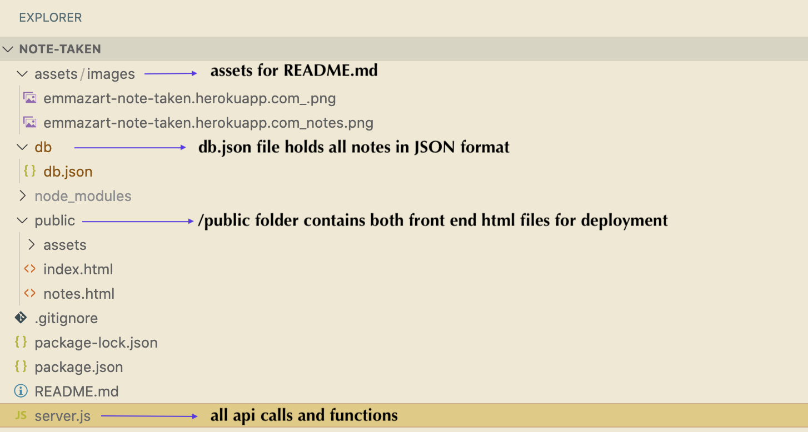
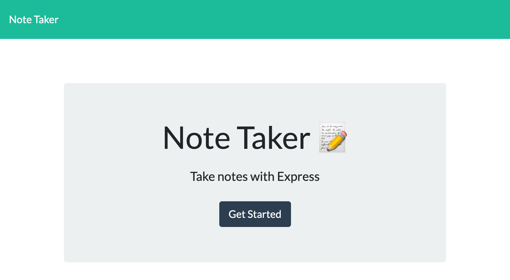
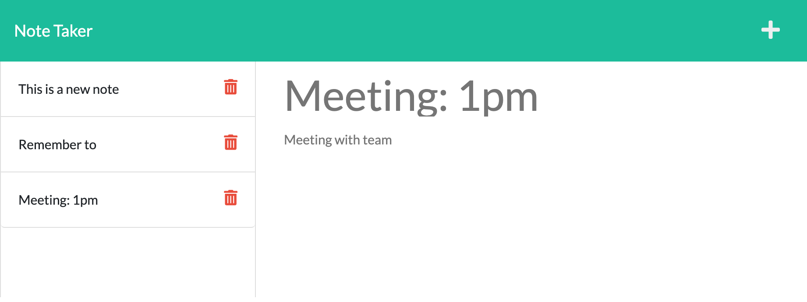

# Note Taken

## Purpose
This Note Taker application has been developed to allow users to write, save, delete, and view notes via the deployed application on Heroku. It stores all notes in a JSON file and uses API endpoints to facilitate the interaction between user and data. 

### User Story
AS A small business owner
I WANT to be able to write and save notes
SO THAT I can organize my thoughts and keep track of tasks I need to complete

## Application Details
This application is deployed with Heroku. Live deployment links can be found below in the [Deployed Application section.](#deployed-application)

This application stores note data in JSON format in the db.json file. It then uses this file via the fs module to store and retrieve notes. 

### Installation
No installation is necessary to utilize the deployed version of this application.

For collaborators, this application can be cloned to your local machine, installed with npm install, and run locally with npm start. You can then navigate to the local host on your broswer at [http://localhost:3001/api/notes.](http://localhost:3001/api/notes) 

### Code Summary

There are 2 HTML routes: 
- GET / returns index.html (landing page)
- GET /notes returns notes.html (secondary webpage)

There are 4 API routes:
- GET /api/notes reads db.json file and returns all saved notes as JSON
- GET /api/notes/:id reads db.json file and returns note with matching id
- POST /api/notes receives a new note to save on the request body, adds it to the db.json file, and then returns the new note to the client
- DELETE /api/notes/:id receives a query parameter containing the id of a note to delete, determines the index of the note with a matching id, splices it out of the notesArray, and rewrites the array to the db.json file

### Technologies Used
Frontend: HTML, CSS, Javascript
Backend: Javascript, Node.js

Project dependencies: Express.js & UUID package [(UUID docs)](https://github.com/uuidjs/uuid)

### File Structure

Screenshot of file structure:

## Deployed Application

[Link to deployed application via Heroku](https://emmazart-note-taken.herokuapp.com/notes)

Deployed index.html

Deployed notes.html with a few notes saved

